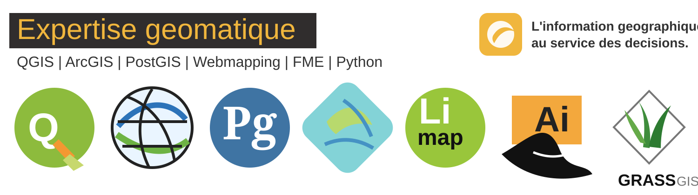

# Bienvenue sur la documentation professionnelle en Geomatique

{: .geomatique-banner }

## Auteur:

**Abdoulhakim ELMI MAHAMOUD**  
Geomaticien - Web SIG - Cartographie - Bases de donnees spatiales  
Mail : [ing.abdoulhakim.elmi@gmail.com](mailto:ing.abdoulhakim.elmi@gmail.com)

Site developpe pour organiser mon profil professionnel autour de la geomatique. Il rassemble mon CV, mes experiences, mes competences, mes projets et les ressources techniques que je construis progressivement.

## Objectifs du site

- Presenter mon CV dans une page claire et professionnelle.
- Stocker mes experiences, stages et missions realisees.
- Classer mes competences par domaine : SIG, Web SIG, bases de donnees, Python, FME et teledetection.
- Mettre en valeur mes projets GitHub et mes productions cartographiques.
- Garder une documentation technique propre, lisible et facile a enrichir.

## Quelques contenus disponibles

- **CV professionnel** : profil, formation, certifications et parcours.
- **Experiences** : DIR Est, ARULoS, projets universitaires et travaux pratiques.
- **Competences SIG** : QGIS, ArcGIS Pro, ArcGIS Enterprise, cartographie et analyse spatiale.
- **Bases de donnees geographiques** : PostgreSQL, PostGIS, modelisation et requetes spatiales.
- **Web SIG** : Leaflet, HTML, CSS, JavaScript, GeoServer et publication de donnees.
- **Automatisation** : Python, FME, traitements de donnees et workflows.
- **Projets** : cartes interactives, documentation technique et outils GitHub.

## Positionnement professionnel

Je travaille a l'intersection de trois domaines :

- SIG et cartographie pour representer les territoires et les infrastructures.
- Bases de donnees spatiales pour structurer, fiabiliser et exploiter l'information.
- Developpement Web SIG pour rendre les donnees accessibles aux equipes metier.

## Outils principaux

  
  
  
  
  
  
  
  
  
  
  
  

